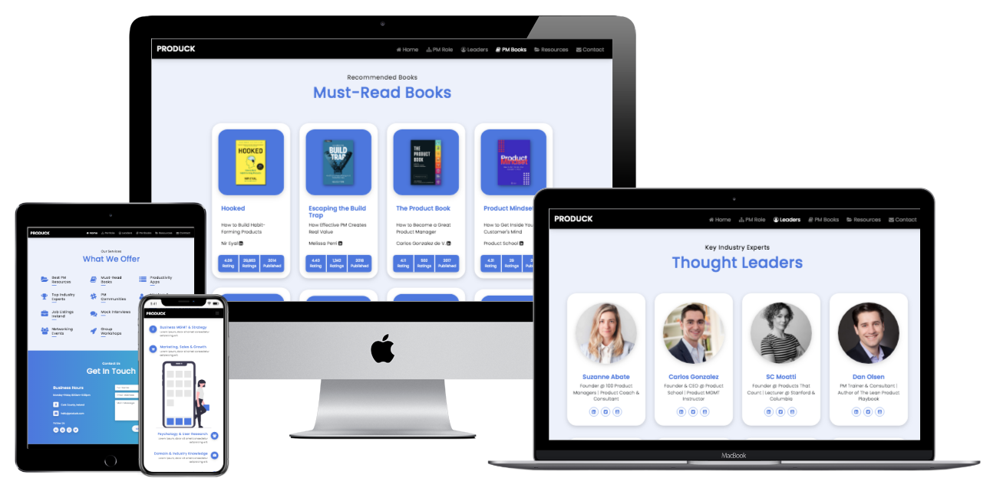
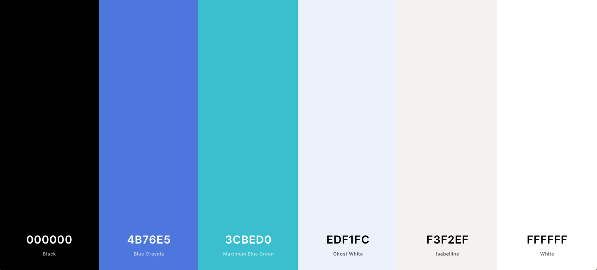
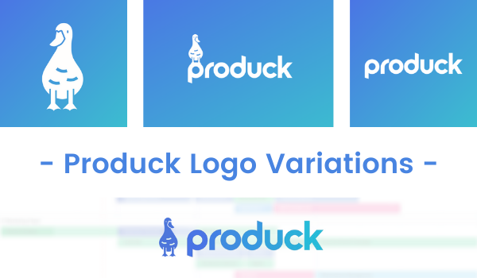

# **[Produck | PM & Productivity Apps](https://effiemanyos.github.io/ms2-produck/)**



**[VIEW WEBSITE LIVE](https://effiemanyos.github.io/ms2-produck/)**

## **Interactive Front-End Development Milestone Project 2**

### **Project Overview**

This project consists of a **interactive front-end platform** built to help **aspiring PMs** break into Product Management despite having a non-technical background, by providing them with professionally selected external resources and **[Produck](https://effiemanyos.github.io/ms2-produck/)**'s productivity tools so that they can land their first PM job and properly excel in the role. From a business perspective, this project's main purpose is to **strategically build a strong community of product professionals within Ireland, a way to network and build relationships with international industry experts, promote and sell Produck's membership, workshops, and online courses, become an important Irish thought leader**. 

This is the **second milestone project** in obtaining a **[Full-Stack Web Development](https://codeinstitute.net/full-stack-software-development-diploma/) University-Rated Professional Diploma** from **[Code Institute](https://codeinstitute.net/)**. Regarding the technologies used, **HTML**, **CSS**, and **JavaScript** were required for this project (**jQuery**, **jQuery UI**, **Bootstrap**, and **APIs** were optional); however, as observed, other technologies were also slightly used to improve the overall quality and user experience.

-------

# **CONTENT** 

- [Project Overview](#project-overview "Project Overview")
- [UX Design](#ux-design "UX Design")
  - [Strategy Plane](#strategy-plane "Strategy Plane")
    - [Target Audience](#target-audience "Target Audience")
    - [User Needs](#user-needs "User Needs")
    - [Business Goals](#business-goals "Business Goals")
    - [User Goals](#user-goals "User Goals")
    - [User Stories](#user-stories "User Stories")
    - [Unique Selling Proposition](#unique-selling-proposition "Unique Selling Proposition")
  - [Scope plane](#scope-plane "Scope plane")
    - [Existing Features](#existing-features "Existing Features")
    - [Future Iterations](#future-iterations "Future Iterations")
  - [Structure Plane](#structure-plane "Structure plane")
    - [Website Structure](#website-structure "Website Structure")
    - [Planned Structure](#planned-structure "Planned Structure")
    - [Future Additions](#future-additions "Future Additions")
  - [Skeleton Plane](#skeleton-plane "Skeleton Plane")
    - [Wireframes](#wireframes "Wireframes")
  - [Surface Plane](#surface-plane "Surface Plane")
    - [Typography](#typography "Typography")
    - [Color Scheme](#color-scheme "Color Scheme")
    - [Imagery](#imagery "Imagery")
- [Technologies Used](#technologies-used "Technologies Used")
- [Testing](#testing "Testing")
- [Deployment](#deployment "Deployment")
- [Credits](#credits "Credits")
- [Acknowledgements](#acknowledgements "Acknowledgements")

______

# **UX DESIGN**  

## **Strategy Plane** 
____

### **Target Audience**
- Recent Graduates (Tech/Non-Tech Background)
- Product Enthusiasts (Curious & Passionate)
- Aspiring Product Managers
- Entry-Level Product Managers
- APMs (Associate Product Managers)
- Non-Tech Background Professionals
- Entrepreneurs (Founders & Co-Founders)
- Professionals Transitioning Into PM

**Produck** is targeting professionals passionate about Technology, Products, Innovation; people constantly looking to solve customers' pain-points and struggles by leveraging the use of technology.

**Targeted Countries:** Ireland & UK (Main Markets)

**Targeted Age:** Not Specified

All under the constraints of a **tight/no budget to spend on expensive bootcamps** (e.g. Product School or Kellogg School of Management).

### **User Needs**

These are some crucial **user pain points or struggles** worth mentioning:

1. **Lack of Trust** | Users do not know how to differentiate between high-quality content and poor or fake PM content on the internet, as they do not have previus professional experience in the field.
2. **Quantity Over Quality** | There is too much information all over the internet, but most sources share vague, superficial or inaccurate content about Product Management. 
3. **Overwhelming & Exhausting** | It is overwhelming and exhausting for users to navigate through all those online resources (too many options to choose from), while also trying to find the right information from the right source without having to consult friends or colleagues.
4. **Lack of Time** | There is too much going on in users' lives at the moment (esp. during the global pandemic) that they do not have the time to search for the information themselves because it is proven that it takes a lot of time to do the research every time.
5. **Fear of Missing Out (FOMO)** | Users have also shared during the user research that they constantly feel that they are missing out on great tips and valuable content from high-quality resources (esp. from Fortune 100 companies, book authors, mentors, industry experts).
6. **Lack of Official Studies** | There is a lack of official Product Management studies offered by universities and colleges. Users are looking for cost-effective bootcamps, workshops, cohorts, mentors, and online courses to learn more about this relatively new field in the tech industry.

### **Business Opportunity**

- Growth demand for Product Managers
- Golden age of Product Management 
- Tech gap in the Irish market
- Boom in the tech industry worldwide
- Product economy is increasing

### **What Are Users Looking For?**

Users are looking for **ONE THING** (their main goal):
- **Break Into Product Management**, which means getting their first PM role and start their PM career from there!

### **User Goals**

*Produck's Services & User Goals From Their POV:*
- Use the mentoring and coaching programmes to break into Product Managemen, which means getting my first PM role in a tech company.
- Access the up-to-date directory of the best Product Management online resources (professionally selected by Produck) and thought leaders (international industry experts) to learn from the best.
- Attend to Produck's networking events to meet other aspiring Product Managers, as well as people already in the industry to learn from their past experiences.
- Join Produck's PM community to share my passion and strong interest for Product Management and Technology with other product enthusiasts.
- Attend Produck's group workshops and take their online courses to develop key PM skills and gain some practical knowledge by working on small side projects, not just by reading, listening, or watching content.
- Stay up-to-date with bite-sized news and information on the latest trends, methods, frameworkds, tools, products, technology by clicking on the website's Social Media icons to follow Produck's social channels.
- Constantly check Produck's job board with entry-level PM roles based in Ireland (or remote worldwide) to start applying to the ones I like the most.(**)
- Watch Produck's weekly live interviews with Q&As at the end to learn from other PMs working at Fortune 100 companies in Ireland or other countries.
- Locate the best and most useful PM mock interviews recommended by Produck to ace mine and get my dream job in Product Management.

*Important Features:*
- Use the Produck's **productivity web-based applications** to help me build a reading habit to learn as much as possible from book authors, which are experts in the field(*)
- Use the **tobuylist web-based application** to keep track of the books I am planning to buy within the next six months and be mindful of the budget I will be allocating or investing in this. 
- Use the **toreadlist web-based application**
- Use the **booknotes web-based application**
- Use the **toratelist web-based application**
- Use the **bookmarks web-based application** to save my favourite online sources of information about Product Management taken from Produck's resources directory.


>(*) Currently, books are one of the most reliable (cost-effective) source of information about Product Management. This is the main reason why Produck's owner has decided to create various web-based applications using Vanilla JavaScript, jQuery, and Local Storage to help Produck users set their own objectives and track their reading milestones in the same platform where they can also learn more about Product Management through other carefully selected external resources.          
(**) This is not part of the MVP features but Produck will do have a job board.

All these are **assumptions** from insights gathered during previus user research. However, they still need to be validated once the MVP is launched.

**In summary, the users' main goals are the following:**
- Get my first PM role
- Learn from the best
- Network with other PMs
- Save time and money
- Build relationships
- Be part of a community
- Get involved in Ireland
- Develop key PM skills
- Gain PM experience
- Always be up-to-date

### **Business Goals**
Site Owner's Goals:
- Create an active Irish Product Management community
- Incentivate women based in Ireland to pursue tech roles
- Increase Produck's client base for mentoring & training
- Build an audience of passionate PMs
- Help aspiring PMs land their first PM role
- Build brand awareness in Ireland & UK
- Expand networking opportunities
- Connect with industry experts & leaders
- Become thought leaders in Ireland & UK
- Promote Produck's core services 
- Develop a professional online presence
- Increase collaborations & partnerships
- Make team's knowledge & experience profitable
- Reduce the tech gap in Ireland (lack of tech professionals)
- Reduce the gender gap in the tech industry (lack of women in tech)
- Support the Irish economy by helping boost great building and innovation

### **User Stories**

**Key Produck's Features:**
- ToBuyList App
- ToReadList App
- BookNotes App
- ToRateList App
- Bookmarks App


**Target Audience:**
- As an **Entrepreneur/Solopreneur**, I want to **register** to Effie's **online workshop** so that I can boost my business' monthly sales.
- As a **Tech Startup**, I want to **use** Effie's **free online resources** so that we can create a robust Digital Marketing strategy.
- As a **SME**, I want to **book** a **free consultaiton** with Effie so that we can increase our business' online presence and engagement. 
- As a **Non-Profit**, I want to **contact** Effie for a **collaboration** and **consulting session** so that we can grow the organization organically.  
- As a **Mentee**, I want to **apply** to Effie's **mentorship program** so that I can get the proper guidance to build my professional career.
- As an **Entry-Level Professional**, I want to **join** Effie's **networking community** so that I can land my first full-time job faster through contacts.
- As a **Recent Graduate**, I want to **consume** Effie's **free courses and resources** so that I can launch my business idea.
- As a **Professional Expat**,I want to **learn** from Effie's successful journey so that I know where to start mine as a new international professional in Ireland.  

**Visitor Types:**

*First-Time Visitor:*
- As a **First Time Visitor**, I want to know **who Effie is** and **what she does** so that I can evaluate if I need her expertise to scale my business (SMEs)
- As a **First Time Visitor**, I want to know what **qualifications** Effie has so that I can use the resources she offers to increase my client base and profit (Entry-Level Professionals)
- As a **First Time Visitor**, I want to know what kind of **services** Effie offers so that I can come back whenever I need them to launch my business idea (Entrepreneurs)
- As a **First Time Visitor**, I want to Know **what other people say about Effie** so that I can hire her to manage my social media accounts (Solopreneurs)
- As a **First Time Visitor**, I want to know about Effie's **work experience** so that I can get in touch with her once I finish my studies (Recent Graduates)

*Returning Visitor:*
- As a **Returning Visitor**, I want to **make sure** Effie's **site is not a scam** so that I can pay for her services before the product launch (Tech Startups)
- As a **Returning Visitor**, I want to **contact** Effie so that we can work together on my business growth and retention rates (SMEs)
- As a **Returning Visitor**, I want to **book** Effie's **free consultation** so that I can create a solid Digital Marketing strategy for my business (Solopreneurs)
- As a **Returning Visitor**, I want to **call Effie directly** so that I can start working with her on my personal branding to get a corporate job in Ireland (Professional Expats)
- As a **Returning Visitor**, I want to **send Effie a message** so that I can be sure that she would be able to work on the product-market fit for my business idea (Recent Graduates)

*Frequent Visitor:*
- As a **Frequent Visitor**, I want to **register** to Effie's **upcoming online workshops and events** so that I can learn more marketing and business skills for my entrepreurial venue (Recent Graduate)
- As a **Frequent Visitor**, I want to **join Effie's community for expats (Huasi)** so that I can meet more connections to land my dream job faster (Professional Expats)
- As a **Frequent Visitor**, I want to **pay a monthly or annually subscription** so that I can always be up to date with the latest methods and frameworks for my business growth (Entrepreneurs)
- As a **Frequent Visitor**, I want to **pay online for Effie's services** so that I can reduce churn and increase product adoption and customer retention (Tech Startups)
- As a **Frequent Visitor**, I want to **get the freemium plan** so that I can use Effie's free resources and implement them to growth my business (Solopreneurs)

These are just some of the user stories that were created for this project. However, not all of these will be met due to an important reduction of the initial scope. The MVP is now more oriented to building brand awareness, confidence, trust and social proof. The features required by the **returning visitors** will be implemented by the second month after the launch of the MVP.

### **Unique Selling Proposition**

USPs or Core Differentiators:

**Service Principles:**
- Bite-Sized Content
- High-Quality Content
- Carefully Selected Content
- Up-To-Date Content
- Free Content & Resources
- Recommended PM Content
- Connecting Professionals 
- Exclusive PM Content
- Irish-Oriented (Irish Recruiting Information)
- 1:1 Mentoring & Coaching Sessions
- **Productivity Web-Based Apps** (Key Service)
  - ToReadList App → Users are able to create a list of up to 10 books (per category) that they want to read in order of priority. They can also separte the books in categories (e.g. Product, Data Analytics, Software Development, Marketing, Business, etc.).
  - ToBuyList App → Users are able to create a list of up to 10 books they are planning to buy. Once they have already bought them, they can remove them from the list.
  - ToRateList App → Users are able to rate the top must-read PM books (already listed) depending on how much value they provided, or if they even liked them at all.
  - MyBookNotes App → Users are able to create short notes of what they consider the most important concepts mentioned in the books they are reading. These notes will then be useful for them when starting their first role as APM.
  - Bookmarks App → Users are able to save their favourite sources of information about PM in a simple but useful list. They just need the name and the URL of that source to save it.

**Website Functionality:**
- Immediate Response (Chatbot)
- User-friendly (Intuitive)
- Positive User Experience
- 100% Responsive
- Up-To-Date Content
- High-Quality Content
- Networking Opportunities
- Connection to Slack Community
- Notify Me by Email (Events, News, Resources, Courses)
- Login/Logout (Instead of Local Storage)
- Membership Options (Monthly/Annual Subscription)
- Fast Loading Platform
- MVP w/Local Storage (Replace in 1nd Iteration)
- Night Mode (Web-Based Applications)

[Back to Content](#content)


## **Scope Plane** 
____

### **Existing Features**

**About Me *"Page"*:**
- **About Me** → Users can see a brief summary of Effie's biography and who she is. Users are also able to get in touch with her by clicking on the CTA button "Let's Talk!".
- **Work Experience** → Users can see a high level description of Effie's work experience and are able to visit each company's official website by clicking on each logo. Users can also visit Effie's LinkedIn profile by clicking on the CTA button "View More".
- **Qualifications** → Users can see Effie's education and are able to visit each school's official website by clicking on each logo. Users can also visit Effie's LinkedIn profile by clicking on the CTA button "View More".
- **Communities** → Users can see the communities Effie is part of and are able to visit each community's official website by clicking on each logo.

**Services *"Page"*:**
- **Services Types** → Users can see the type of services Effie provides, and by clicking on the CTA button "Request Free Consultation", they are able to request a free consultation with her.
- **Services Fields** → Users can see Effie's services fields and are able to see at least **four** of the services' detailed description to have an idea of what she provides.

**Training *"Page"*:**
- **Learning Hub** → Users can see all the ways they can learn new theory and skills provided by Effie's team. 

**Contact *"Page"*:**
- **Contact Me Form** (*) → Users are able to fill out the form to contact Effie. However, the form is not fully functional at the moment.  
- **Contact Information** → Users can see Effie's location, mobile number, social media channels, and email. Users can contact her via any of those channels during the indicated opening hours. 

**Footer *Section*:**
- **Footer** → Users can see a brief summary of who Effie is and what she offers.
- **Social Media** Links → Users can visit Effie's social media channels by clicking on each icon.
- **Newsletter Quick Sign Up Form** (*) → Users can fill out a quick sign up form to receive Effie's monthly newsletter straight to their inbox.

>(*) Not fully functional at the moment

### **Future Iterations**

These are some of the features that still need to be implemented to have a fully working website as required by the owner: 

**Home *"Page"*:**
- Welcome Video or Hero Video
- Featured In or Partners Section
- Key Figures Section
- Instagram Feed Section
- Clients Section

**About *"Page"*:**
- Side Projects Section
- Volunteering Section

**Services *"Page"*:**
- Entrepreneurship Section
- Recommended Partners Section
- Case Studies Section

**Training *"Page"*:**
- Live Workshops Section
- Online Webinars Section
- Online Courses Section
- 1:1 & Group Sessions Section
- Podcast & YouTube Section
- Blog & Newsletter Section
- Virtual Meetups Section

**Resources *"Page"*:**
- Books & eBooks Section
- Blogs & Newsletters Section
- Podcasts & Clubhouse Section
- PPL/SM/YT Channels Section
- Free/Cheap Tools Section
- Other Resources Section

**Join Us *"Page"*:**
- Memberships (Plans & Pricing) Section
- Join Huasi Section
- Join NetCork Section
- P&C (Partnerships & Collaborations) Section

**Contact *"Page"*:**
- Calendly Integration ("Book a Call" or "Request Free Consultation")

**Other Features:**
- Blog
- Chatbot
- Pop Up Lead Magnet & Form
- Login/Logout (Navigation Bar)
- Restricted Access (Memership Plans)
- Membership Payment (Monthly & Annually)
- Functional Forms (Contact & Newsletter)
- Registration Forms (Events, Courses, Workshops...)
- Newsletter Long Form
- News & Upcoming Events
- Link Forms to Webserver (Data Collection)
- GDPR Compliance Cookies Policy
- Search (Website Content)
- Store (Merchandising)

Eventually, integrations or links to tools like Notion, Miro, Trello, Eventbrite, Slack, Google Calendar, Teachable might be included in the website.

[Back to Content](#content)

## **Structure Plane** 
____

### **Website Structure**

At the moment, the platform consists of only **10 pages and 11 sections**. The **current structure** of the website is the following:

|HOME|PM ROLE|LEADERS|PM BOOKS|RESOURCES|CONTACT|
|--|----|-----|---|---|---|
|Produck|What Is PM?|Industry Experts|Must-Read Books|Key Resources||
|Services|Career Path|Networking App|ToReadList App|Bookmarks App||
|Contact|What PMs Do||ToBuyList App|Tech Companies||
|Top Links|Background||ToRateListApp|||
||Soft Skills||MyNotes App|||

**Sections:**
- Navigation Bar
- Jumbotron
- About
- Services
- Contact
- Footer
- What Is PM?
- Career Path
- What PMs Do
- Background
- Soft Skills

**Pages:**
- Industry Experts
- Networking App
- Must-Read Books
- ToReadList App
- ToBuyList App
- ToRateList App
- MyNotes App
- Key Resources
- Bookmarks App
- Tech Companies

### **Future Additions**

The sections that will be added in the near future are the following:

|HOME|ABOUT|SERVICES|TRAINING|RESOURCES|JOIN US|CONTACT|
|---|---|---|---|---|---|---|
|Welcome Video (#)|Side Projects|Entrepreneurship|Workshops & Webinars|Books & eBooks|Memberships|Book a Call (**)|
|Featured In (*)|Volunteering|Recommended Partners|Online Courses|Blogs & Newsletters|Join Huasi||
|Key Figures||Case Studies (Clients)|1:1 & Group Sessions|Podcasts & Clubhouse|Join NetCork||
|Instagram Feed|||Podcast & YouTube|PPL/SM/YT Channels|P&C||
|Clients|||Blog & Newsletter|Free/Cheap Tools||
||||Virtual Meetups|Other Resources (^)||

## **Skeleton Plane** 
____

### **Wireframes**

- **Dektop**
- **Tablet**
- **Mobile**


[Back to Content](#content)

## **Surface Plane** 
____

### **Typography**

Only one font was used for this project.

- **[Poppins](https://fonts.google.com/specimen/Poppins?query=Poppins&preview.text_type=custom)**, designed by Indian Type Foundry, Jonny Pinhorn, for all paragraphs.

**Font Styling:**

The following styling has been used for consistency and alignment throughout the entire website:
- **Titles (h1, h2):** 

```CSS
/* Main Titles Styling */
.titles {
    font-family: Neucha, Helvetica, sans-serif;
    font-size: 40px;
    letter-spacing: 4px;
    text-transform: uppercase;
    text-align: center;
}
```

### **Color Scheme**

According to an article on **[The Science of Colour Persuasion](https://idealogicbrandlab.com/color-persuasion/)** by **IDealogic® Brand Lab**:

Colour establishes **brand recognition** amongst consumers, therefore it is crucial that the same colours are always used across all channels, such as website, social media, advertising, product packaging, merchandising, etc.

The following are the colours used for this project:



**Primary Colours:**
> - **Purple** → Associated with **trust, loyalty, dependability, logic, security, serenity, and stimulates productivity**.
> - **Black** → Associated with **sophistication, luxury, security, power, elegance, authority, and substance**.
> - **Green** → Associated with **health, growth, freshness, prosperity, hope, encourages balance and harmony**.
> - **White** → Associated with **innocence, purity, cleanliness, and simplistic**.

### **Logo Variations**

 

### **Imagery**

The illustration from the 'Background' section was taken from **[UnDraw](https://undraw.co/)** to improve the UX. The illustration has been edited to match the website and brand colours (branded).

Professional photographies from **[Unsplash](https://unsplash.com/)** have been used for the 'Hero Image', 'About Produck' and 'About PM' sections of the website. 

When ready, professional photos and videos will be added to the website in various sections. Some of the images and videos will come from:
- Live Workshops
- Networking Events
- Online Webinars
- PM Conferences
- Collaborations
- Community Activities

At the moment, the imagery used is for academic purposes only in order to meet the project deadline. These images will be replaced before the launch of the website.

[Back to Content](#content)

# **TECHNOLOGIES USED** 

The following technologies were used during the development and testing of this project:

### **Languages**

- **HTML5** to structure each page.
- **CSS3** to style the elements within each page.
- **Vanilla JavaScript** to make the website interactive.
- **jQuery** to make the website interactive.
- **API** to allow the user to send a message or subscribe.

### **Workspaces, Version Control, Respository Hosting**
- Store Repositories → [GitHub](https://github.com/)
- Main Workspace → [Gitpod](https://www.gitpod.io/)
- Version Control → [Git](https://git-scm.com/)

### **Frameworks & Libraries**
- Frameworks → [Bootstrap V4.6.0](https://getbootstrap.com/)
- Fonts → [Google Fonts](https://fonts.google.com/)
- Icons → [Font Awesome V4.7.0](https://fontawesome.com/v4.7.0/icons/)
- jQuery → [jQuery V3.6.0](https://blog.jquery.com/2021/03/02/jquery-3-6-0-released/)
- jQuery UI → [jQuery UI V1.12.1](https://jqueryui.com/download/all/)

### **Code Consultations**
- Git Commit Messages → [Chris Beams | How to Write a Git Commit Message](https://chris.beams.io/posts/git-commit/)
- CSS Tricks → [CSS Tricks](https://css-tricks.com/)
- HTML/CSS/JAVASCRIPT → [W3Schools](www.w3schools.com)
- HTML/CSS/JAVASCRIPT → [Stack Overflow](https://stackoverflow.com/questions/10422949/css-background-opacity)
- Validate, Beautify, Format HTML/CSS/JS → [Free Formatter](https://www.freeformatter.com/css-beautifier.html)
- Hex to RGB → [RapidTables](https://www.rapidtables.com/convert/color/hex-to-rgb.html)
- Rem to PX → [nekoCalc](https://nekocalc.com/rem-to-px-converter)
- Hover Over Effects → [Hover.css](https://ianlunn.github.io/Hover/)
- Website Icon → [Geeks For Geeks](https://www.geeksforgeeks.org/how-to-add-icon-logo-in-title-bar-using-html/) 
- Favicon → [W3C](https://www.w3.org/2005/10/howto-favicon) 

### **Testing Process**
- Test/Fix Code → [Chrome DevTools](https://developers.google.com/web/tools/chrome-devtools)
- Website Responsiveness → [Responsive Viewer](https://www.producthunt.com/posts/responsive-viewer)
- Website Performance → [Google Lighthouse](https://developers.google.com/web/tools/lighthouse)
- Validate HTML → [W3C HTML Validator](https://validator.w3.org/)
- Validate CSS → [W3C CSS Validator](https://jigsaw.w3.org/css-validator/)
- Validare JS → 


- Web Accessibility Evaluation → [WAVE](https://wave.webaim.org/)

### **Other Technologies**
- Responsive Design → [Responsive Design](http://ami.responsivedesign.is/)
- Mockup → [Techsini Mockup Generator](http://techsini.com/multi-mockup/)
- Unicode Symbols → [Cool Symbol](https://coolsymbol.com/)
- Illustrations → [UnDraw](https://undraw.co/)
- Photography → [Unsplash](https://unsplash.com/)
- Low Fidelity Wireframing → [Balsamiq](https://balsamiq.com/) (*)
- Planning → [Miro](https://miro.com/)
- Planning → [Trello](http://trello.com/)
- Visuals → [Canva](https://www.canva.com/)
- Colour Scheme → [Coolors](https://coolors.co/)
- Hex Color Codes (Variants) → [Color Hex](https://www.color-hex.com/)
- Shapes & Diagrams → [Google Drawing](https://chrome.google.com/webstore/detail/google-drawings/mkaakpdehdafacodkgkpghoibnmamcme)
- Crop Portraits → [Crop Circle](https://crop-circle.imageonline.co/)
- Image Compression → [TinyJPG](https://tinyjpg.com/)

>(*) This tool was used to create the first version of wireframes (first draft during brainstorming session). Nonetheless, the structure and the design of the website was modified afterwards to meet the project deadline.

[Back to Content](#content)

# **TESTING**  

The entire testing process, issues and bugs found during development, solutions, and final results can be found [here](https://github.com/effiemanyos/ms2-produck/blob/master/testing.md).

- Issues Solved During Development
- HTML-CSS-JavaScript Validation Testing
- Testing Performance
- Testing Accessibility
- Testing User Stories
- Code Institute Peer Code Review

[Back to Content](#content)

# **DEPLOYMENT**

### **GitHub Pages**

This project was deployed to **GitHub Pages** following these steps:

1. Login to **[GitHub](https://github.com/)**
2. Insert the following **GitHub Repository** name in the **Search Bar** to locate the project: **[effiemanyos/ms2-produck](https://github.com/effiemanyos/ms2-produck)**
3. Click on that repository to view more details
4. Click on **Settings**, which is located right above the **Gitpod** green button
5. Scroll all the way down to the **GitHub Pages** section
6. Under **Source**, select **Master** in the dropdown menu
7. Select **/(root)** in the tab which is right next to **Branch**
8. Click **Save** (*Note:* the page will automatically refresh)
9. Scroll all the way down again to the **GitHub Pages** section
10. Finally, you can see the link where the site is published highlited with a light green/blue background 

Follow these visual steps [here](https://github.com/effiemanyos/ms2-produck/blob/master/assets/images/github-pages.png).

### **Run Project Locally**

1. Login to **[GitHub](https://github.com/)**
2. Insert the following **GitHub Repository** name in the **Search Bar** to locate the project: **[effiemanyos/ms2-produck](https://github.com/effiemanyos/ms2-produck)**
3. Select **Code** and click on **Download ZIP File**
4. You can extract the file and use it in your local environment once it is downloaded

### **Clone & Fork GitHub Repository**

Additionally, you can either **Clone** or **Fork** this repository ([ms2-produck](https://github.com/effiemanyos/ms2-produck)) into your [GitHub](https://github.com/) account by following these guides:
- **[Cloning a Repository](https://docs.github.com/en/github/creating-cloning-and-archiving-repositories/cloning-a-repository)**
- **[Fork a Repository](https://docs.github.com/en/github/getting-started-with-github/fork-a-repo)**

[Back to Content](#content)

# **CREDITS** 

### **Inspiration**
- [Product School](https://www.productschool.com/)
- [Mind the Product](https://www.mindtheproduct.com/)
- [The PM Library](https://thepmlibrary.com)
- [Women in Product](https://www.womenpm.org/)
- [Product Buds](https://productbuds.co/)
- [Product People](https://getproductpeople.com/)
- [Product Hustle Stack](https://producthustlestack.co/)

### **Code Snippets**

*Predefined Code*
- Preinstalled  Tools (Development) → [Code Institute Gitpod Full Template](https://github.com/Code-Institute-Org/gitpod-full-template)

*Head Section*
- Metadata (SEO Purposes) → [W3Schools](https://www.w3schools.com/tags/tag_meta.asp)
- Favicon (Tiny Icon) → [Geeks For Geeks](https://www.geeksforgeeks.org/how-to-add-icon-logo-in-title-bar-using-html/) 

*Navigation Bar Section*
- NavBar (Responsiveness) → [Bootstrap](https://getbootstrap.com/docs/4.0/components/navbar/)
- Hoverable Dropdown Menu (Layout) → [W3Schools](https://www.w3schools.com/howto/howto_css_dropdown.asp)
- Anchors (Fixed Issue) → [Stack Overflow](https://stackoverflow.com/questions/10732690/offsetting-an-html-anchor-to-adjust-for-fixed-header)
- Link to Section of Another Page (Internal Linking) → [Stack Overflow](https://stackoverflow.com/questions/17687328/getting-a-link-to-go-to-a-specific-section-on-another-page)

*Hero Image Section*
- Hero Image Section (Layout) → [W3Schools](https://www.w3schools.com/howto/howto_css_hero_image.asp)

*About Section*
- About Section (Layout) → [Code Opacity](https://www.youtube.com/watch?v=TlKBoetaDsc)

*Contact Section*
- Contact Section (Inspiration) → [True Coder](https://www.youtube.com/watch?v=rpujWVkmiPE)
- Contact Information (Email Link) → [Tutorials Point](https://www.tutorialspoint.com/html/html_email_links.htm)
- Email JS API → [Code with Voran](https://www.youtube.com/watch?v=x7Ewtay0Q78)
- Reload Page After OK Click → [Stack Overflow](https://stackoverflow.com/questions/16955019/how-to-reload-a-page-after-the-ok-click-on-the-alert-page)

*Bookmarks App*
- Bookmarks App (Layout) → [Traversy Media](https://www.youtube.com/watch?v=DIVfDZZeGxM) by [Brad Traversy](https://www.linkedin.com/in/bradtraversy/)
- JavaScript HTML DOM (addEventListener() method) → [W3Schools](https://www.w3schools.com/js/js_htmldom_eventlistener.asp)
- JavaScript ES5 Features → [W3Schools](https://www.w3schools.com/js/js_es5.asp)
- Data Structures: Objects & Arrays → [Eloquent JavaScript](https://eloquentjavascript.net/04_data.html) by Marijn Haverbeke
- Local Storage: Why Only Stores String Values → [PixelsTech](https://www.pixelstech.net/article/1586062871-Why-localStorage-only-allows-to-store-string-values)
- Parse JSON Into String (JSON.stringify()) → [W3Schools](https://www.w3schools.com/js/js_json_stringify.asp)
- JavaScript Loops (For Loop) → [W3Schools](https://www.w3schools.com/js/js_loop_for.asp)
- Alter HTML Code w/JavaScript → [Stack Overflow](https://stackoverflow.com/questions/17650776/add-remove-html-inside-div-using-javascript)
- JavaScript Form Validation → [W3Schools](https://www.w3schools.com/js/js_validation.asp)
- URL Regular Expression (Regex) → [Stack Overflow](https://stackoverflow.com/questions/3809401/what-is-a-good-regular-expression-to-match-a-url)

*BookNotes App*
- BookNotes App (Layout) → [ZinoTrust Tutorials](https://www.youtube.com/watch?v=unrmB4H7Wmw)
- JavaScript Conditionals (If/Else Statement) → [MDN Web Docs](https://developer.mozilla.org/en-US/docs/Web/JavaScript/Reference/Statements/if...else)
- Adding Key/Value to JS Object → [Stack Overflow](https://stackoverflow.com/questions/1168807/how-can-i-add-a-key-value-pair-to-a-javascript-object)
- JavaScript Array (findIndex() Method) → [MDN Web Docs](https://developer.mozilla.org/en-US/docs/Web/JavaScript/Reference/Global_Objects/Array/findIndex)

*ToBuyList App*
- ToBuyList App (Layout) → [Traversy Media](https://www.youtube.com/watch?v=JaMCxVWtW58) by [Brad Traversy](https://www.linkedin.com/in/bradtraversy/)
- Local Storage (Array of Objects) → [Stack Overflow](https://stackoverflow.com/questions/43762363/how-to-store-an-array-of-objects-in-local-storage)
- Local Storage (Inspiration) → [LogRocket](https://blog.logrocket.com/localstorage-javascript-complete-guide/)
- Window.localStorage (Inspiration) → [MDN Web Docs](https://developer.mozilla.org/en-US/docs/Web/API/Window/localStorage)
- JavaScript Validation Messages (Bootstrap Alerts) → [Bootstrap](https://getbootstrap.com/docs/4.0/components/alerts/#dismissing)
- JavaScript Arrays (splice() Method) → [JavaScript Tutorial](https://www.javascripttutorial.net/javascript-array-splice)
- JavaScript HTML DOM (previousElementSibling Property) → [W3Schools](https://www.w3schools.com/jsref/prop_element_previouselementsibling.asp)
- JavaScript DOM traversal (Inspiration) → [Zellwk](https://zellwk.com/blog/dom-traversals/)

*ToReadList App*
- ToReadList App (Layout) → [Crypters Infotech](https://www.youtube.com/watch?v=5sQMEc5jZXg)

*Dark Mode Feature*
- Dark Mode - Video (Inspiration) → [DesignCourse](https://www.youtube.com/watch?v=ZKXv_ZHQ654) by [Gary Simon](https://www.linkedin.com/in/dreamache/)
- Dark Mode - Article (Inspiration) → [Marcin Wichary](https://mwichary.medium.com/dark-theme-in-a-day-3518dde2955a)

*Resources Page*
- Top Resources Section (Layout) → [SoengSouy Webdesign](https://www.youtube.com/watch?v=8bZFNgVRY0w) by [Soeng Souy](https://www.linkedin.com/in/soeng-souy-b9b179193/)
- Table Columns Width (Inspiration) → [Site Point Community](https://www.sitepoint.com/community/t/set-a-table-columns-width/12821)

*Leaders Page*
- Industry Experts Section (Layout) → [Master Website Tutorials](https://www.youtube.com/watch?v=HOHpKjddTdw)

*Responsibilities Section*
- What PMs Do Section (Layout) → [Zen-Dev](https://www.youtube.com/watch?v=iJSgQ7N4qa0)

*Key Soft Skills Section*
- Soft Skills Section (Layout) → [CodingNepal](https://www.youtube.com/watch?v=0198ceyTVtg)
- Bootstrap Grid System (Responsive Columns) → [Bootstrap](https://getbootstrap.com/docs/4.0/layout/grid/)
- Bootstrap Display Property (Responsiveness) → [Bootstrap](https://getbootstrap.com/docs/4.0/utilities/display/)

*Background Section*
- The Perfect PM Section (Inspiration) → [Code Institute Love Running Mini-Project](http://bit.ly/37M38Jz)
- The Perfect PM Section (Layout) → [Subrata Saha](https://www.youtube.com/watch?v=ZRouuWvN-7A)

*Top PM Books Page*
- Top PM Books Section (Inspiration) → [Red Stapler](https://www.youtube.com/watch?v=cwC1qdPWBKo)
- Top PM Books Section (Layout) → [CSS Coder](https://www.youtube.com/watch?v=HR-Jg3xSQRc)

*Footer Section*
- Footer Section (Layout) → [Divinector](https://www.youtube.com/watch?v=4jelwvPcS8w)

All these snippets of code have been fully customized for this project's requirements and to match the look and feel of the website.

### **Media**

*'Hero Image' Section:*
- [KW: Team Work | Photo 1](https://unsplash.com/photos/QckxruozjRg) by [Annie Spratt](https://unsplash.com/@anniespratt) taken from [Unsplash](https://unsplash.com/)

*'About Produck' Section:*
- [KW: Diversity | Photo 2](https://unsplash.com/photos/98Elr-LIvD8) by [Zachary Nelson](https://unsplash.com/@zacharytnelson) taken from [Unsplash](https://unsplash.com/)

*'What Is PM?' Section:*
- [KW: Product Management | Photo 3](https://unsplash.com/photos/bzqU01v-G54) by [Leon](https://unsplash.com/@myleon) taken from [Unsplash](https://unsplash.com/)

*'Leaders' Page:*
- [Suzanne Abate](https://www.linkedin.com/in/suzanneabate/) → Portrait Image taken from [LinkedIn](https://www.linkedin.com/)
- [Carlos Gonzalez de Villaumbrosia](https://www.linkedin.com/in/villaumbrosia/) Portrait Image taken from [LinkedIn](https://www.linkedin.com/)
- [SC Moatti](https://www.linkedin.com/in/scmoatti/) → Portrait Image taken from [LinkedIn](https://www.linkedin.com/)
- [Dan Olsen](https://www.linkedin.com/in/danolsen98/) → Portrait Image taken from [LinkedIn](https://www.linkedin.com/)
- [Lewis C. Lin](https://www.linkedin.com/in/lewislin/) → Portrait Image taken from [LinkedIn](https://www.linkedin.com/)
- [Lena Haydt](https://www.linkedin.com/in/lenahaydt/) → Portrait Image taken from [LinkedIn](https://www.linkedin.com/)
- [Gibson Biddle](https://www.linkedin.com/in/gibsonbiddle/) → Portrait Image taken from [LinkedIn](https://www.linkedin.com/)
- [Janna Bastow](https://www.linkedin.com/in/jannabastow/) → Portrait Image taken from [LinkedIn](https://www.linkedin.com/)
- [Ryan Hoover](https://www.linkedin.com/in/ryanrhoover/) → Portrait Image taken from [LinkedIn](https://www.linkedin.com/)
- [Mirela Mus](https://www.linkedin.com/in/mirelamus/) → Portrait Image taken from [LinkedIn](https://www.linkedin.com/)
- [Martin Eriksson](https://www.linkedin.com/in/martineriksson/) → Portrait Image taken from [LinkedIn](https://www.linkedin.com/)
- [Melissa Perri](https://www.linkedin.com/in/melissajeanperri/) → Portrait Image taken from [LinkedIn](https://www.linkedin.com/)

*'Background (The Perfect PM)' Section:*
- Illustration taken from [UnDraw](https://undraw.co/) and edited to match the brand and website color scheme.

*'Top PM Books (Must-Read Books)' Page:*
- [Hooked by Nir Eyal](https://www.pendo.io/) → Book Cover taken from [Goodreads](https://www.goodreads.com/)
- [Escaping the Build Trap by Melissa Perri](https://www.pendo.io/) → Book Cover taken from [Goodreads](https://www.goodreads.com/)
- [The Product Book by Carlos Gonzalez](https://www.pendo.io/)→ Book Cover taken from [Goodreads](https://www.goodreads.com/)
- [Product Mindset by Product School](https://www.pendo.io/) → Book Cover taken from [Goodreads](https://www.goodreads.com/)
- [Measure What Matters by John E. Doerr](https://www.pendo.io/) → Book Cover taken from [Goodreads](https://www.goodreads.com/)
- [Crossing the Chasm by Geoffrey A. Moore](https://www.pendo.io/) → Book Cover taken from [Goodreads](https://www.goodreads.com/)
- [Shape Up by Ryan Singer](https://www.pendo.io/) → Book Cover taken from [Goodreads](https://www.goodreads.com/)
- [The Mom Test by Rob Fitzpatrick](https://www.pendo.io/) → Book Cover taken from [Goodreads](https://www.goodreads.com/)
- [Inspired by Marty Cagan](https://www.pendo.io/) → Book Cover taken from [Goodreads](https://www.goodreads.com/)
- [Range by David Epstein](https://www.pendo.io/) → Book Cover taken from [Goodreads](https://www.goodreads.com/)
- [Cracking the PM Interview by Gayle McDowell](https://www.pendo.io/) → Book Cover taken from [Goodreads](https://www.goodreads.com/)
- [100 Things by Susan Weinschenk](https://www.pendo.io/) → Book Cover taken from [Goodreads](https://www.goodreads.com/)

This section will contain a lot more books for aspiring PMs to read. These books will be related to various disciplines (leadership, business, technology, product management, design, analytics, among others). However, this will be implemented in the next iteration.

*'Top Resources' Page:*
- [Pendo](https://www.pendo.io/) → Logo and Founder(s) taken from Official Website
- [Product School](https://www.productschool.com/) → Logo and Founder(s) taken from Official Website
- [Product Love by Eric Boduch](https://www.pendo.io/) → Logo and Founder(s) taken from Official Website
- [The Product Folks](https://www.theproductfolks.com/) → Logo and Founder(s) taken from Official Website
- [Masters of Scale](https://mastersofscale.com/) → Logo and Founder(s) taken from Official Website
- [Product People](https://getproductpeople.com/) → Logo and Founder(s) taken from Official Website
- [Rocketship FM](https://rocketship.fm/) → Logo and Founder(s) taken from Official Website
- [Women in Product](https://www.womenpm.org/) → Logo and Founder(s) taken from Official Website
- [100 Product Managers](https://www.100productmanagers.com/) → Logo and Founder(s) taken from Official Website
- [Productized](https://productized.co/) → Logo and Founder(s) taken from Official Website
- [Silicon Valley Product Group](https://svpg.com/) → Logo and Founder(s) taken from Official Website
- [Amplitude](https://amplitude.com/) → Logo and Founder(s) taken from Official Website
- [Product Buds](https://productbuds.co/) → Logo and Founder(s) taken from Official Website
- [Product Manager HQ](https://productmanagerhq.com/) → Logo and Founder(s) taken from Official Website
- [280 Group](https://280group.com/) → Logo and Founder(s) taken from Official Website
- [Product Hunt Radio](https://www.producthunt.com) → Logo and Founder(s) taken from Official Website
- [Mind the Product](https://www.mindtheproduct.com/) → Logo and Founder(s) taken from Official Website
- [One Knight in Product](https://www.oneknightinproduct.com/) → Logo and Founder(s) taken from Official Website

This section will contain a lot more resources for aspiring PMs to access. However, this will be implemented in the next iteration.

[Back to Content](#content)

# **ACKNOWLEDGEMENTS** 

I would like to thank the following people for their constant support and guidance during my learning process: 
- [Code Institute Slack Community](https://code-institute-room.slack.com/)
- [Adegbenga Adeye (Mentor)](https://www.linkedin.com/in/adegbenga-adeye-psm-i-14003635/)

[Back to Content](#content)